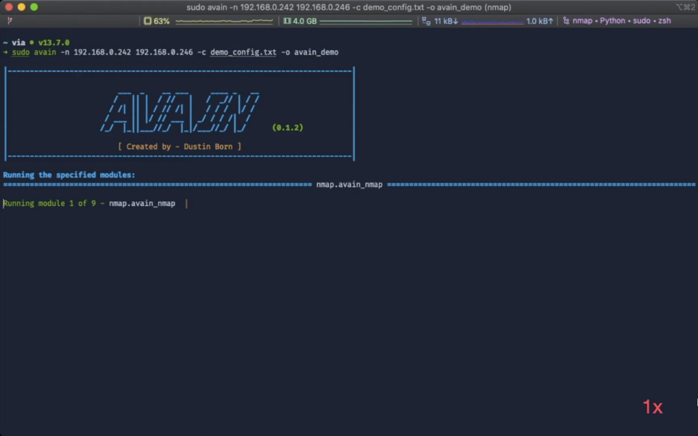

# AVAIN - Automated Vulnerability Analysis (in) IP-based Networks
A framework for the automated vulnerability analysis in IP-based networks that enables its modules to work collaboratively by sharing results.

<p>
<a href="#"></a>
<a href="#"></a>
<a href="#">"></a>
<a href="https://github.com/ra1nb0rn/avain/blob/master/LICENSE"></a>
<a href="https://github.com/ra1nb0rn/avain/wiki"></a>
<a href="#"></a>
</p>

## About
AVAIN is a modular vulnerability analysis / penetration testing framework for computer networks and individual machines that allows its modules to work collaboratively to achieve more sophisticated results. Once you start an analysis with AVAIN, it uses its modules to enumerate, find vulnerabilities and assess the overall security level of an IP-based network or host. During the analysis, the most relevant results are shown directly in a comprehensible way. The complete and in depth results are saved for later to enable the user to fully retrace the assessment. In addition, AVAIN automatically aggregates certain types of results during the analysis to make it easier for modules to utilize them. Eventually the analysis finishes, upon which AVAIN outputs a final score between 0 and 10, where the higher the score, the more vulnerable / insecure the assessed object(s).

At its core, AVAIN is an extensible framework that uses modules to do vulnerability assessment. As such it offers several features that make it easier to develop completely new modules or build on top of existing ones. These features include:
* simple result sharing and storage
* aggregation of results
* simple and uniform way of configuring modules
* modules are implemented in Python; other tools can be wrapped
* modules can specify install and update scripts

For more information about AVAIN's framework features, look at the [separate wiki page](https://github.com/ra1nb0rn/avain/wiki/Framework-Features). To see how to develop new modules with Python, have a look at [this](https://github.com/ra1nb0rn/avain/wiki/Creating-a-New-Module) wiki page.


## Current Features of Modules
The currently available modules can automatically:
- **General network reconnaissance**
  - [x] Facilitate an [Nmap](https://nmap.org/) scan &amp; postprocess it
- **Correlation of scan results with vulnerabilities and exploits**
  - [x] Retrieve [CVE](https://cve.mitre.org/) / [NVD](https://nvd.nist.gov/) entries that affect the discovered software by using a local vulnerability database
  - [x] Connect the [CVE](https://cve.mitre.org/) / [NVD](https://nvd.nist.gov/) entries to existing exploits from the [Exploit Database](https://www.exploit-db.com/)
- **Web server enumeration**
  - [x] Brute force directories and files on a webserver via a configurable wordlist using [Gobuster](https://github.com/OJ/gobuster)
  - [x] Completely scrape a webserver, i.e.:
    - [x] crawl paths via [Scrapy](https://github.com/scrapy/scrapy)
    - [x] find GET / POST parameters and cookies
    - [x] find source code comments
    - [x] find new network locations / domains
  - [x] Find even more vulnerability / attack vectors by using [Selenium](https://www.selenium.dev/) to discover content that only becomes visible when interactively opening websites within a web browser
- **Active web vulnerability detection**
    - [x] Dynamically detect SQL Injection vulnerabilities via [sqlmap](https://github.com/sqlmapproject/sqlmap) by utilizing the previously scraped website data from other modules
- **Specific analysis of common web technologies / frameworks**
  - [x] Discover [WordPress](https://github.com/WordPress/WordPress) installations in any sub folder of a web server and analyze them using [WPScan](https://github.com/wpscanteam/wpscan)
- **SMB enumeration & vulnerability detection**
  - [x] Use [SMBMap](https://github.com/ShawnDEvans/smbmap) and [Enum4Linux](https://github.com/portcullislabs/enum4linux) to enumerate SMB services
  - [x] Use [Nmap](https://nmap.org/) vulnerability scripts to discover vulnerable SMB services
- **Credential Bruteforcing**
  - [x] Brute force credentials for SSH &amp; Telnet services via [Hydra](https://github.com/vanhauser-thc/thc-hydra) and a configurable wordlist

A more detailed overview of the current modules, what they can do and how they work is available in the [wiki](https://github.com/ra1nb0rn/avain/wiki/Module-Overview). All of AVAIN's modules are highly configurable. As a small example, you can configure authentication cookies to be used or regex URLs to be excluded while scraping a website. For a full list of configuration parameters and how to use them properly, have look at the separate [wiki page](https://github.com/ra1nb0rn/avain/wiki/Configuration). In addition, despite AVAIN being fairly verbose during the analysis, all the result files that contain even more information are stored in AVAIN's output directory. While the file structure should be simple to understand, it is further explained in the [wiki](https://github.com/ra1nb0rn/avain/wiki/Output-Structure).

**Important:** If you intend to run AVAIN against a sensitive or valuable system, be sure to configure it properly beforehand and know what to expect. Some modules, e.g. the sqlmap module, can run aggressive / intrusive scans that may not be side-effect free and break things on the scanned host.


## Demo
For demonstration purposes, AVAIN was run against [*Kioptrix 3*](https://www.vulnhub.com/entry/kioptrix-level-12-3,24/) and [*Basic Pentesting 1*](https://www.vulnhub.com/entry/basic-pentesting-1,216/) (with additional SMB service running) from VulnHub. Disclaimer: parts of the scan are sped up in the video, see the bottom right corner. Click on the image to go the video on YouTube:
<p align="center">
    <a href="https://www.youtube.com/watch?v=VN12gwXahr8">
      
    </a>
</p>

The obtained results are available in the [``sample_result``](sample_result) folder.


## Installation
AVAIN was made to work on Unix based systems. It was tested to work on macOS, Ubuntu Linux and Kali Linux. You can either install it directly on your system or use the available Dockerfile. To install it directly &amp; automatically, run the ``install.sh`` script. As the script attempts to install AVAIN's required software, you may have to run it as *root* or get asked for a password. If you do not have *apt* (Linux) or *Homebrew* (macOS) as your package manager installed, you can simply change the package manager at the top of the script. For other issues feel free to open an issue. Since macOS by default does not have a package manager installed, you may have to install [Homebrew](https://github.com/Homebrew/brew) first. For more information on the installation process and potential problems, see the [wiki page](https://github.com/ra1nb0rn/avain/wiki/Getting-Started).


## Usage
To use AVAIN, simply call it by typing ``avain`` without any arguments in a terminal and you will see the following usage information:

<p align="center">
    
</p>

Further insight on AVAIN's usage information is available at [this](https://github.com/ra1nb0rn/avain/wiki/Usage) wiki page.

For running AVAIN on some target like ``192.168.42.1``, the corresponding call is:
```
avain -n 192.168.42.1
```
The contents of the created output folder should mostly be simple to understand, but a [separate wiki page](https://github.com/ra1nb0rn/avain/wiki/Output-Structure) goes into more detail.

Three more examples of how you can call AVAIN:
* ``avain -n 192.168.0.* -uM -p T:80,U:53 -o http_dns_sec``
* ``avain -n 10.0.42.* 192.168.0.1-150 -sN -c config/someconfig.cfg -v``
* ``avain -sR path_to_sr_1 path_to_sr_2 -o network_analysis``


## Wiki
In case you have more question about AVAIN, the [wiki](https://github.com/ra1nb0rn/avain/wiki/) is very detailed and explains AVAIN in great detail.


## Contribution & Bugs
If you want to contribute, or have any questions or suggestions, use GitHub or directly contact me via Email <a href="mailto:dustin.born@gmx.de">here</a>. If you found a bug or have other troubles, feel free to open an issue.


## License
AVAIN is licensed under the MIT license, see [here](https://github.com/ra1nb0rn/avain/blob/master/LICENSE).


## Miscellaneous
I originally created AVAIN as part of my Bachelor Thesis at TU Darmstadt (located in Germany) under the guidance of my advisor Rolf Egert. After my thesis I decided to continue working on AVAIN in my spare time. We presented a demo paper about AVAIN at NetSys&nbsp;'19. In addition, we presented a full paper based on AVAIN at the IEEE GLOBECOM 2019 Workshop on Security and Privacy in Smart, Cooperative IoT and CPS. For more info see the [Publications](https://github.com/ra1nb0rn/avain/wiki/Publications) wiki page.
